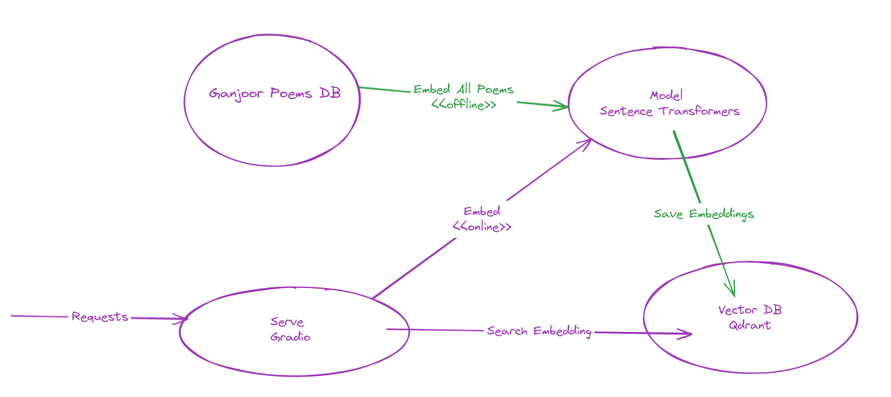

## Semantic Search Engine for Ganjoor Poems

- Read from `ganjoor.s3db.zip` sqlite https://github.com/ganjoor/desktop/releases/tag/v2.81 (use latest version instead)
- Embed poems  (sentence transformers)
  - https://www.sbert.net/docs/pretrained_models.html#multi-lingual-models
  - https://huggingface.co/sentence-transformers/paraphrase-multilingual-mpnet-base-v2
- Insert into Qdrant
  - https://github.com/qdrant/qdrant
  - http://localhost:6333/dashboard
- Serve + Test with Gradio
  - https://www.gradio.app/guides/quickstart
  

- Deploy somewhere
- Telegram bot

Idea from <- https://pubmedisearch.com , https://osanseviero.github.io/hackerllama/blog/posts/sentence_embeddings/
 

## Design


## Run
```shell
pip install -r requirements.txt
docker compose up -d
jupypter notebook # open main.ipynb
```

تست:

حافظ رفت میکده یه نفر بهش گفت که برو خودت رو بشور بعد بیا اینجا که آلوده نشه
-> دوش رفتم به در میکده خواب آلوده ....
